# md2pdf

把中文 Markdown 排成**带封面、带页码目录、带跑动页眉、带 PDF 书签**的正式文档。

针对中文长文档（技术方案、调研报告、学习讲义、产品手册）调过版式，尤其是**表格多**的文档。

```bash
python md2pdf.py 你的文档.md
```

就这一行。输出同目录同名 `.pdf`。想换一种版式，加 `-s 样式名` 即可，共有 7 种内置样式（见[第 3.0 节](#30-内置样式)）：

```bash
python md2pdf.py 你的文档.md -s 公文
```

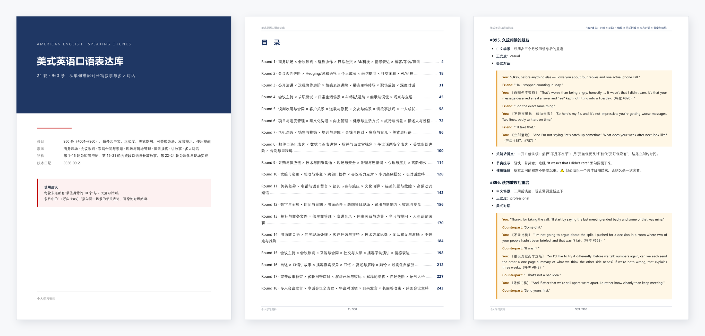

**不需要装** LaTeX、pandoc、wkhtmltopdf、WeasyPrint。只要三个 pip 包 + 一个你本来就有的浏览器。

---

## 目录

- [它解决什么问题](#它解决什么问题)
- [效果](#效果)
- [1. 先装依赖](#1-先装依赖)
- [2. 三分钟上手](#2-三分钟上手)
- [3. front-matter 完整配置表](#3-front-matter-完整配置表)
- [4. 命令行参数](#4-命令行参数)
- [5. 写 Markdown 的注意事项](#5-写-markdown-的注意事项)
- [6. 它是怎么工作的](#6-它是怎么工作的)
- [7. 排查故障](#7-排查故障)
- [8. 想改样式](#8-想改样式)
- [9. 已知限制与替代方案](#9-已知限制与替代方案)
- [10. 返工复盘：哪些错机器查得出，哪些查不出](#10-返工复盘哪些错机器查得出哪些查不出)
- [11. 对外文件定稿检查清单](#11-对外文件定稿检查清单)
- [12. 出片自检](#12-出片自检selfcheck)
- [13. 作为 Claude Skill 使用](#13-作为-claude-skill-使用)

---

## 它解决什么问题

中文 Markdown 转 PDF，市面上的路子大致三条，各有各的疼：

| 方案 | 疼在哪 |
|---|---|
| LaTeX / Typst | 排版质量最高，但要重写源文档，中文还要配 ctex / 字体 |
| WeasyPrint | 纯 Python，但 Windows 上要装 GTK 运行时，表格能力一般 |
| VS Code 插件 / 在线转换 | 能出 PDF，但没封面、没页码目录、没页眉，交不出手 |

md2pdf 走第四条：**用你电脑上已有的 Chrome 当排版引擎**（Blink 的表格和中文排版是同类里最好的），它做不到的那 10%（页码、页眉、书签）用 PyMuPDF 后期补上。

结果是：源文档还是普通 Markdown，装三个 pip 包，一行命令出成品。

这是个 **opinionated tool**（有主张的工具）——它不做成什么都能配的通用引擎，而是直接替你决定了"中文正式文档该长什么样"：字号、行高、表格样式、页眉规则、分页策略全都定好了。**你要的不是自由度，是省事。**

---

## 效果

截图来自两份文档：

- **封面、目录、正文**：作者自己的一份 **360 页**美式英语口语学习资料，用默认样式直接生成。它本身不在仓库里，放在这里是为了展示长文档的真实效果
- **表格**：[`examples/口语表达库_速查表册.md`](examples/口语表达库_速查表册.md)（17 页），clone 下来能一模一样复现

### 封面与目录

| | |
|---|---|
| 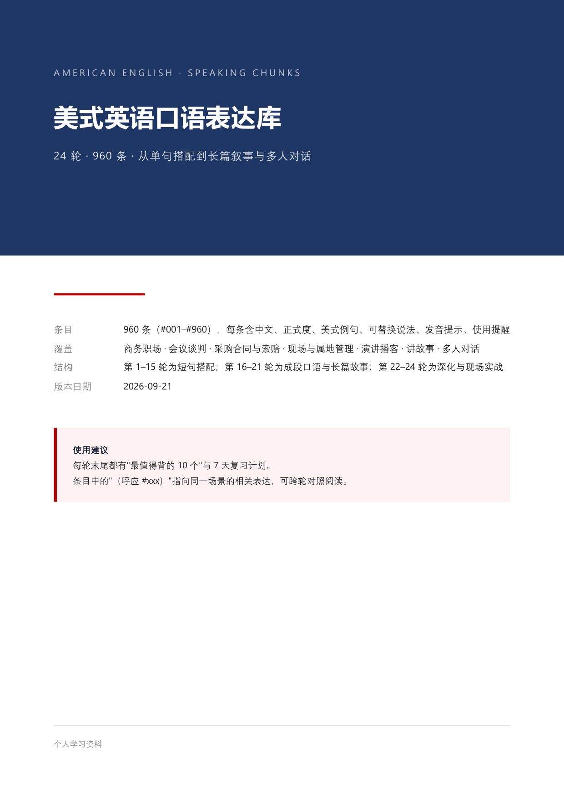 | 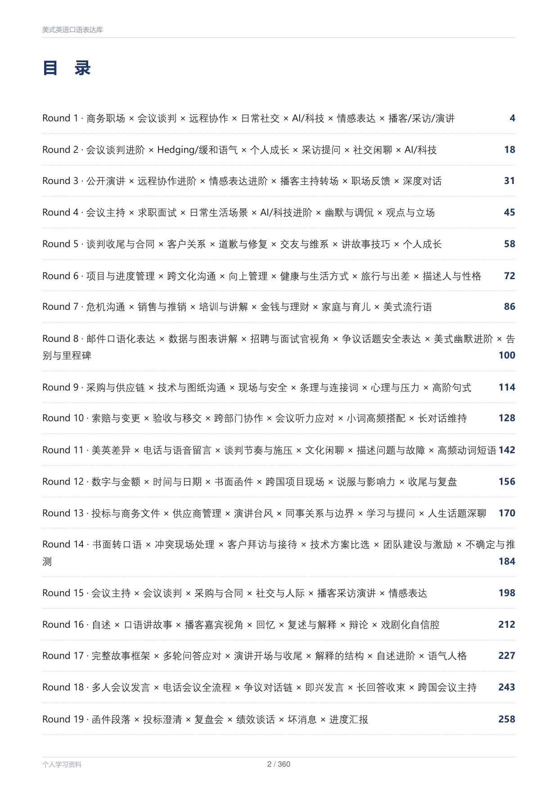 |
| **封面**：色块 + 元信息表 + 提示块，全部由 front-matter 配置 | **目录**：页码是多遍渲染**回填的真实页码**，360 页也一样准 |

### 正文

| | |
|---|---|
| 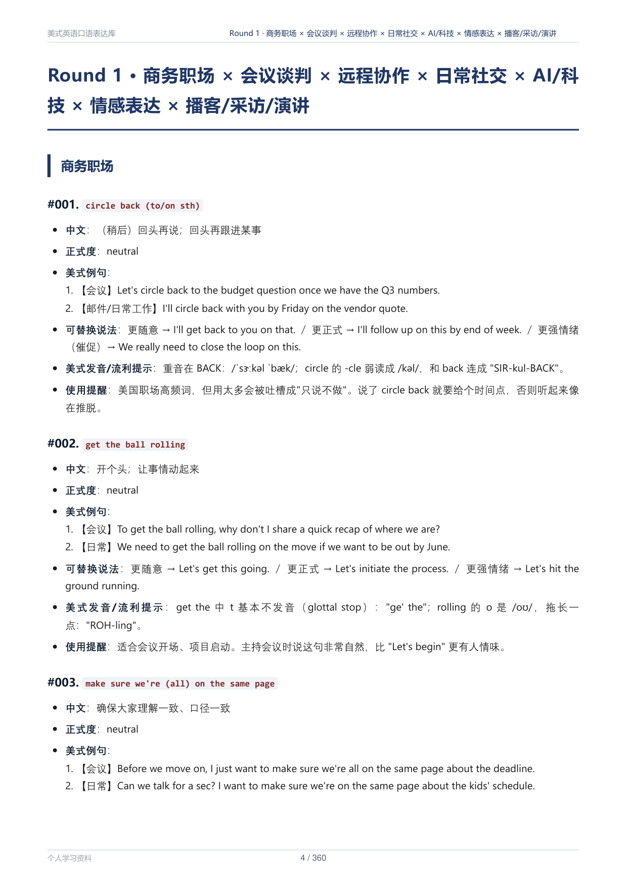 | 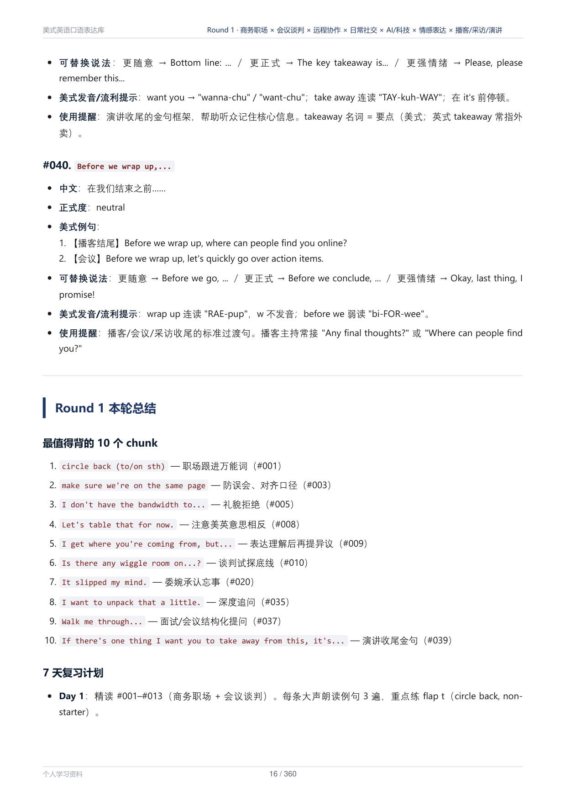 |
| 章节自动分页，行内代码、嵌套列表 | 编号列表 + 行内代码；右上角跑动页眉显示当前所在章节 |
| 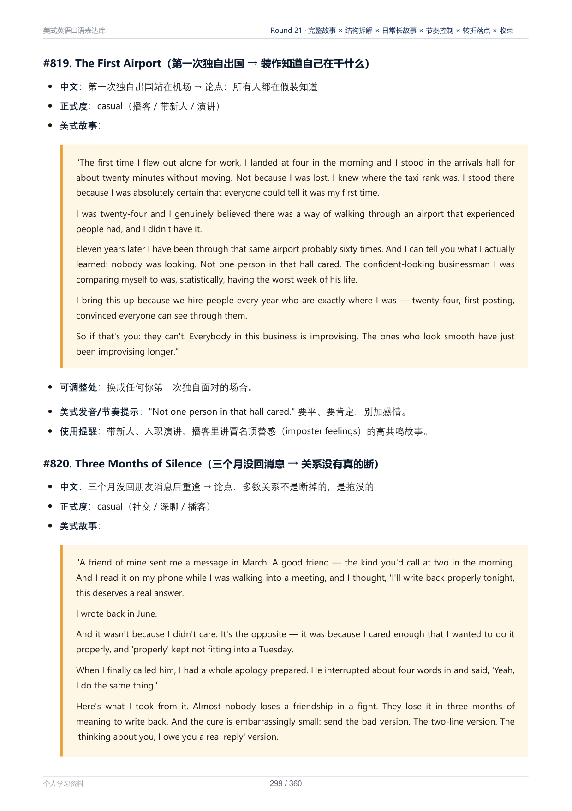 | 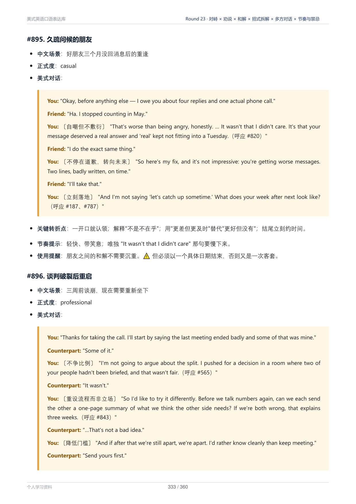 |
| `>` 引用块渲染成提示框，适合放长段落 | 同一页多个提示框，对话、标注混排 |

### 长表格跨页，表头自动重复

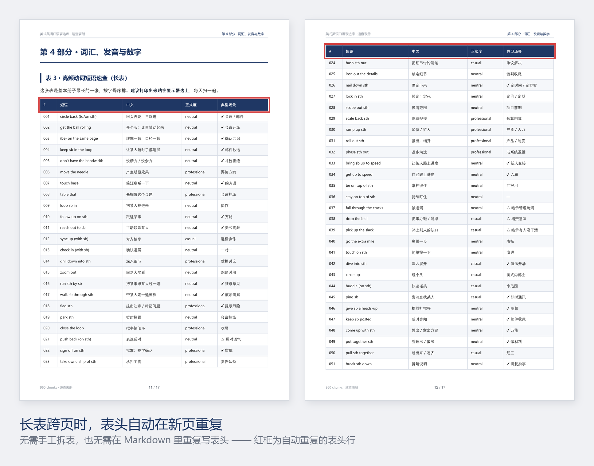

这是做正式文件时最省事的一个特性——**不用手工拆表，也不用在 Markdown 里重复写表头。**

| | |
|---|---|
| 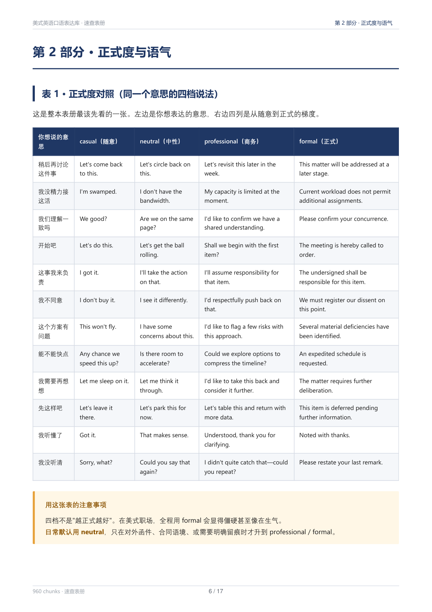 | 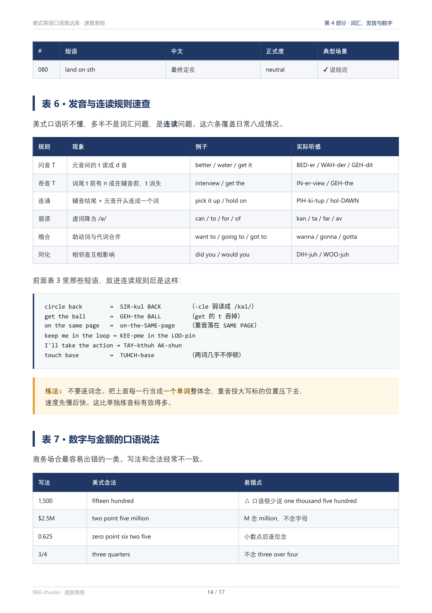 |
| 五列宽表 + 表下提示框，斑马纹与深色表头 | 表格 / 代码块 / 提示框混排 |

---

## 1. 先装依赖

```bash
pip install markdown pymupdf pyyaml
```

或者：

```bash
pip install -r requirements.txt
```

另外需要本机装有 **Chrome 或 Edge**（Windows 一般自带 Edge，够用）。脚本会自动探测这些位置：

```
Windows:  C:\Program Files\Google\Chrome\Application\chrome.exe
          C:\Program Files (x86)\Microsoft\Edge\Application\msedge.exe
macOS:    /Applications/Google Chrome.app/Contents/MacOS/Google Chrome
Linux:    /usr/bin/google-chrome  /usr/bin/chromium  /usr/bin/chromium-browser
```

找不到就用 `--browser "路径"` 指定。

> **Linux 用户注意**：页眉页脚是用 PyMuPDF 直接画的，需要一个 CJK 字体文件。脚本内置的探测列表里 Linux 只有一条 Noto 路径（`/usr/share/fonts/opentype/noto/NotoSansCJK-Regular.ttc`）。如果你的发行版路径不同，页眉的中文会变成方块——用 `fc-list :lang=zh` 找到字体文件，然后在 front-matter 里写 `stamp_font: /你的/字体.ttc`。

---

## 2. 三分钟上手

### 2.1 什么都不配

直接跑。脚本会：

- 拿正文第一个 `# 标题` 当文档标题，做一个简洁封面
- 扫所有 `## ` 标题生成目录，自动算出真实页码
- 每个 `## ` 另起一页
- 加页眉页脚和 PDF 书签

对随手写的文档，这样就够了。

### 2.2 想要正式封面：加 front-matter

在 `.md` 最开头（**必须是第一行**）加一段 YAML。下面是 `examples/` 里示例文档自己用的 front-matter：

```yaml
---
title: 美式英语口语表达库
subtitle: 速查表册 · Quick Reference Tables
kicker: AMERICAN ENGLISH SPEAKING CHUNKS · QUICK REFERENCE
theme: navy
toc_depth: 2
meta:
  表册收录: 9 张速查表 · 4 条完整条目样例
  条目来源: 正文 #001–#960
  编排方式: 场景 × 正式度 双维度
  生成日期: 2026-09-20
notice: |
  本册只收**速查表**，不含例句详解与发音提示。
  带 ✔ 的是**最值得先背**的条目；带 △ 的是有使用风险、需看场合的条目。
cover_footer: 个人学习资料 · American English Speaking Chunks
header_left: 美式英语口语表达库 · 速查表册
footer_left: 960 chunks · 速查表册
---

# 文档标题（会被自动摘掉，封面已经有了）

> 这段引用块也会被自动摘掉（很多人用它写元信息）

## 目录
（手写目录整节会被自动摘掉，PDF 用带页码的自动目录）

## 第 1 章 · 正文从这里开始
```

**封面结构：**

```
┌─────────────────────────────────┐
│ ████████ 深蓝色块 ████████████ │
│  KICKER（小号大写字，可省略）  │
│                                 │
│  标 题                          │  ← title，支持多行
│  第 二 行                       │
│  第 三 行                       │
│                                 │
│  subtitle                       │
│ █████████████████████████████ │
│                                 │
│  ▬▬▬▬  ← 红色短线                │
│                                 │
│  表册收录  xxxxxxxxxxxx         │  ← meta 字典，
│  条目来源  xxxxxxxxxxxx         │     左标签右内容
│  编排方式  xxxxxxxxxxxx         │
│                                 │
│  ┃ 提示块                       │  ← notice，红边浅红底
│  ┃ xxxxxxxxxxxxxxxxxxx         │     支持 Markdown
│                                 │
│  ─────────────────────────      │
│  cover_footer                   │
└─────────────────────────────────┘
```

### 2.3 跑一遍示例

仓库里带了一份可直接复现的示例（17 页，9 张表，含跨页长表）：

```bash
python md2pdf.py examples/口语表达库_速查表册.md
```

输出应该和 `examples/口语表达库_速查表册.pdf` 一致。README 上面的表格效果图就是它的页面。

---

## 3. front-matter 完整配置表

全部可选。命令行参数优先级高于 front-matter。

### 3.0 内置样式

一个样式 = 一整套版式：封面布局、字体、配色、标题、表格、提示框。不指定时用默认样式。

| 样式名 | 中文名（也可直接用） | 长什么样 | 适合 |
|---|---|---|---|
| `default` | 默认 | 深蓝色块封面，雅黑正文，深色表头 | 通用正式文档 |
| `gov` | 公文 / 公文汇报 | 仿宋正文，黑体 / 楷体标题，封面红色双线，段首缩进，章节连排不分页 | 机关、领导汇报材料 |
| `steel` | 钢蓝 / 工程文件 | 左对齐封面，细线信息栏，底部签字栏 | 正式报送文件（现代） |
| `graybl` | 灰蓝 / 技术文件 | 居中封面，宋体正文，双线章标题，底部签字栏 | 正式技术文件（稳重） |
| `consult` | 咨询 / 咨询报告 | 大留白，三线表，核心结论框 | 客户汇报、方案比选 |
| `intl` | 国际 / 国际双语 / 双语 | 藏青整页封面配金线，英文用衬线字体 | 外方客户、中英双语文件 |
| `brief` | 简报 / 高管简报 | 暖灰封面，大号标题，深底结论框 | 领导简报、决策汇报 |

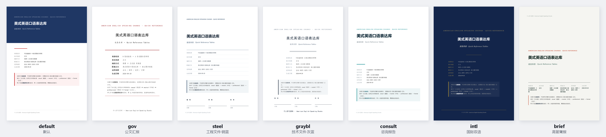

<details>
<summary><b>展开看每种样式的封面、目录、正文、表格页</b></summary>

以下都是同一份 [`examples/口语表达库_速查表册.md`](examples/口语表达库_速查表册.md) 加上 `-s 样式名` 生成的，可以直接复现。

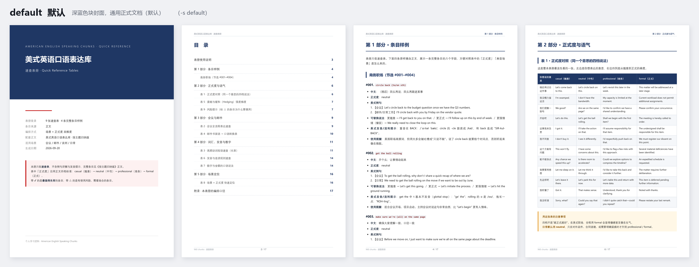
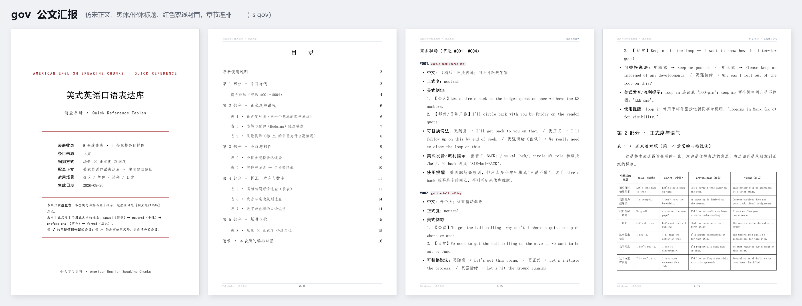
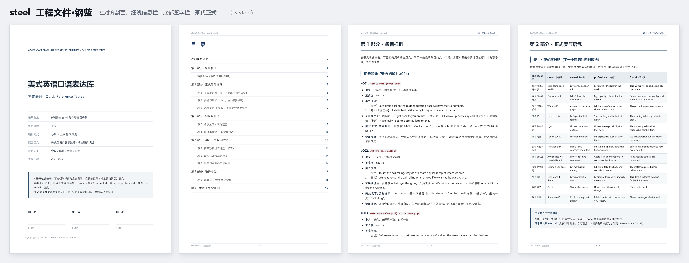
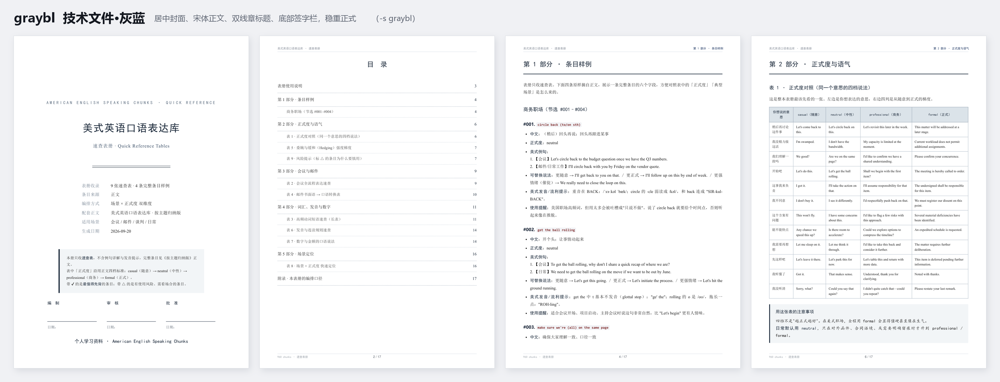
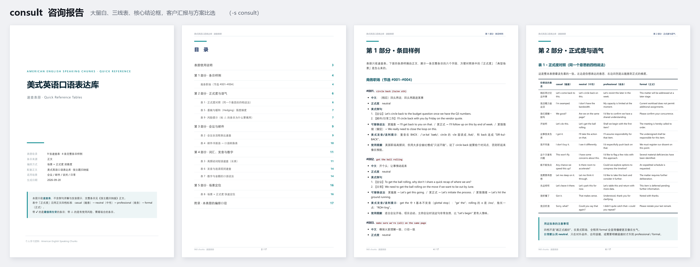
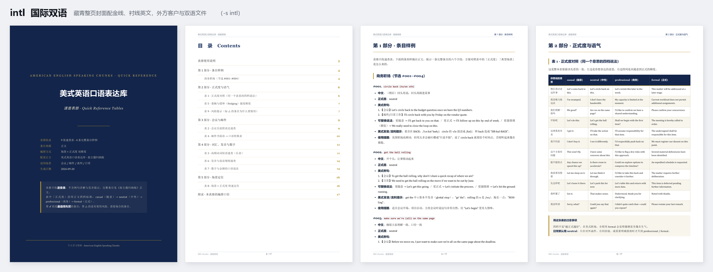
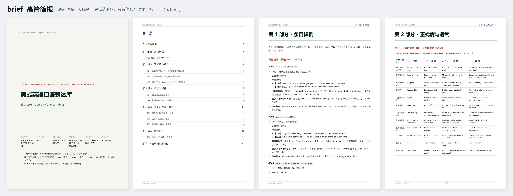

</details>

三种选法，效果相同：

```bash
python md2pdf.py 报告.md -s gov          # 命令行，英文名
python md2pdf.py 报告.md -s 公文         # 命令行，中文名
python md2pdf.py --list-styles           # 忘了名字就列出来看
```

```yaml
---
style: 公文                               # 或写在 front-matter 里
---
```

**样式只是垫底的默认值。** 你在 front-matter 或命令行里写的任何配置都会覆盖它，比如 `style: 公文` 再加 `break_before_h2: true`，就是公文样式但每章另起一页。`extra_css` 会追加在样式 CSS 之后，所以也能改样式里的任何细节。

**签字栏**：`steel` 和 `graybl` 默认在封面底部加「编制 / 审核 / 批准」三栏签名线。其他样式想加就写 `signoff: true`（或命令行 `--signoff`）；想改栏目就给列表，如 `signoff: [编制, 校对, 审核, 批准]`；不想要就写 `signoff: false`。封面内容少时签字栏贴在页面底部，内容多时自动往下排，不会压住上面的内容。

**封面只有一页。** `meta` 行数多、`notice` 很长、再加签字栏时，封面可能放不下。放不下的部分会被截掉，自检会报错并指出缺了什么（见第 12 章）。这是有意为之：如果不截断，Chrome 会把**整份文档**等比缩小来塞下封面，正文字号会被悄悄改小。

> `gov` 样式用到仿宋、楷体、黑体，Windows 自带。公文标题的标准字体是方正小标宋，没装的话会用华文宋体加粗代替。

### 3.1 封面

| 键 | 类型 | 默认 | 说明 |
|---|---|---|---|
| `title` | 字符串 | 正文第一个 `# ` 标题 | 主标题。用 `\|` 块写法可多行 |
| `subtitle` | 字符串 | — | 副标题，色块内标题下方 |
| `version` | 字符串 | — | `subtitle` 的别名（哪个有用哪个） |
| `kicker` | 字符串 | — | 色块顶部的小号大写字，一般写英文项目名 |
| `meta` | 字典 | — | 封面信息表，键是标签、值是内容，**值支持行内 Markdown** |
| `notice` | 字符串 | — | 封面下方的红边提示块，**支持 Markdown 和换行** |
| `cover_footer` | 字符串 | `footer` 的值 | 封面页脚 |
| `cover` | 布尔 | `true` | 设 `false` 不要封面 |
| `band_height` | 尺寸 | `95mm` | 深色块高度。标题多行时要调大 |
| `meta_label_width` | 尺寸 | `26mm` | meta 表左侧标签列宽。标签长要调大 |

### 3.2 目录

| 键 | 类型 | 默认 | 说明 |
|---|---|---|---|
| `toc` | 布尔 | `true` | 设 `false` 不要目录页 |
| `toc_depth` | 1 或 2 | `1` | `1` = 只收 `## `；`2` = 收 `## ` + `### ` |
| `toc_title` | 字符串 | `目　录` | 目录页标题 |
| `drop_manual_toc` | 布尔 | `true` | 自动删掉正文里手写的「## 目录」整节 |

### 3.3 版式

| 键 | 类型 | 默认 | 说明 |
|---|---|---|---|
| `theme` | 字符串 | `navy` | `navy` / `slate` / `forest` / `crimson` / `ink` |
| `paper` | 字符串 | `A4` | `A4` / `Letter` / `A3` / `B5` |
| `landscape` | 布尔 | `false` | 横向。**超宽表格文档很有用** |
| `margin` | CSS | `20mm 16mm 20mm 16mm` | 页边距，上 右 下 左 |
| `break_before_h2` | 布尔 | `true` | 每个 `## ` 另起一页。**短文档设 `false`** |
| `font_size` | 数字 | `10` | 正文字号 pt |
| `line_height` | 数字 | `1.72` | 行高 |
| `title_size` | 数字 | `26` | 封面主标题字号 pt |
| `table_font_size` | 数字 | `8.6` | 表格字号。**列多塞不下就调到 7.5~8** |
| `code_font_size` | 数字 | `8.6` | 代码块字号 |
| `font_body` | CSS | `"Segoe UI","DengXian","Microsoft YaHei",sans-serif` | 正文字体栈 |
| `font_head` | CSS | `"Microsoft YaHei",sans-serif` | 标题字体栈 |
| `font_mono` | CSS | `Consolas,"Cascadia Mono",monospace` | 等宽字体栈 |
| `extra_css` | CSS | — | 追加任意 CSS，覆盖内置样式 |

### 3.4 页眉页脚与元数据

| 键 | 类型 | 默认 | 说明 |
|---|---|---|---|
| `header_left` | 字符串 | 文档标题 | 页眉左侧固定文字 |
| `footer_left` | 字符串 | `footer` 的值 | 页脚左侧固定文字（密级、单位名） |
| `page_numbers` | 布尔 | `true` | 页脚居中的 `n / N` |
| `author` | 字符串 | — | PDF 属性·作者 |
| `subject` | 字符串 | — | PDF 属性·主题 |
| `keywords` | 字符串 | — | PDF 属性·关键词 |
| `pdf_title` | 字符串 | 文档标题 | PDF 属性·标题（与封面标题分开设） |

> **页眉右侧不用配。** 它是「跑动页眉」——自动显示读者当前所在的那一章，翻到哪章显示哪章。

### 3.5 其他

| 键 | 类型 | 默认 | 说明 |
|---|---|---|---|
| `style` | 字符串 | `default` | 内置样式，英文名或中文名，见 3.0 节 |
| `signoff` | 布尔或列表 | 随样式 | 封面签字栏。`true` = 编制/审核/批准；列表 = 自定义栏目；`false` = 不要 |
| `selfcheck` | 布尔 | `true` | 出片后自检空白页 / 占位符残留 / 内容溢出（见第 12 章）|
| `strip_lead_quote` | 布尔 | `true` | 自动摘掉正文开头的 `>` 引用块 |
| `md_extensions` | 列表 | — | 追加 Python-Markdown 扩展，如 `[footnotes, def_list]` |
| `browser` | 路径 | 自动探测 | Chrome/Edge 可执行文件 |
| `stamp_font` | 路径 | 自动探测 | 页眉页脚用的 CJK 字体文件 |

---

## 4. 命令行参数

```
python md2pdf.py 源文件.md [选项]

  -o, --out PATH        输出路径（默认与源同名 .pdf）
  -s, --style NAME      内置样式，英文名或中文名（见 3.0 节）
  --list-styles         列出全部内置样式
  --signoff             封面加「编制 / 审核 / 批准」签字栏
  --theme NAME          只换配色：navy / slate / forest / crimson / ink 等
  --paper NAME          a4 / letter / a3 / b5
  --landscape           横向
  --toc-depth {1,2}     目录层级
  --no-cover            不要封面
  --no-toc              不要目录
  --no-break            ## 不强制另起页（短文档）
  --font-size N         正文字号
  --browser PATH        指定浏览器
  --preview [N ...]     导出第 N 页的 PNG 检查（不给数字默认 1 2）
  --keep                保留中间 HTML/PDF，用于调样式
  -q, --quiet           安静模式
```

**常用组合：**

```bash
# 会议纪要、短通知：不分页不要封面
python md2pdf.py 纪要.md --no-cover --no-break

# 宽表格清单：横向 + 小字号
python md2pdf.py 参数对照表.md --landscape --font-size 9

# 章节多、想要二级目录
python md2pdf.py 手册.md --toc-depth 2

# 改完样式先看效果再定稿
python md2pdf.py 报告.md --preview 1 2 15 --keep
```

---

## 5. 写 Markdown 的注意事项

### 5.1 标题层级怎么用

| 层级 | 渲染成 | 建议用途 |
|---|---|---|
| `# ` | 被摘掉（当文档标题） | 全文只写一个，写在最前面 |
| `## ` | 章标题，**默认另起一页**，下带横线，进目录 | 章 |
| `### ` | 节标题，左侧竖色条 | 节 |
| `#### ` | 小标题，深色加粗 | 小节 |
| `##### ` | 灰色小标题 | 再往下就该考虑重新组织了 |

### 5.2 表格

**这个工具的强项。** 已经处理好的：

- 表头跨页自动重复（`display: table-header-group`）
- 单元格不会被切成两半（`page-break-inside: avoid`）
- 偶数行浅底斑马纹
- 长英文 / URL 在窄列里能断行

**列太多塞不下时，按这个顺序试：**

1. `table_font_size: 7.8`
2. `landscape: true`
3. 拆成两张表

### 5.3 提示框用 `>`

引用块渲染成**橙黄底的提示框**，适合放警告、动作项、重点结论：

```markdown
> **⚠️ 注意**
> 四档不是"越正式越好"，全程用 formal 会显得僵硬甚至像在生气。
```

### 5.4 流程图用代码块

```
    A ──▶ B ──▶ C
           │
           ▼
           D
```

用 ` ``` ` 包起来，渲染成浅灰底 + 左侧色条，等宽字体对齐可靠。中文流程图这么画比装 Mermaid 省事。

### 5.5 强调

| 写法 | 效果 |
|---|---|
| `**加粗**` | 深色加粗 |
| `*斜体*` | **不是斜体**，是浅色底纹高亮（中文斜体很丑，改掉了） |
| `` `代码` `` | 浅灰底、暗红字 |

### 5.6 几个坑

- **front-matter 必须在第一行**，前面不能有空行或 BOM 以外的字符
- **YAML 里带冒号的值要引号**：`副标题: "Round 1: 商务职场"` ← 冒号后有空格会被当成嵌套
- **多行值用 `|`**（保留换行）或 `>`（折成一行）
- 代码块里的 `## ` 不会被误认成标题（已处理围栏状态）
- 文档里手写的 `## 目录` 整节会被自动删掉，不用自己删
- **`---` 分隔线紧挨着 `##` 标题会造出空白页**：`---` 落在新页顶部，`##` 的 `page-break-before:always` 又把标题推到下一页，中间那页只剩一条看不见的横线。已在 `clean_html()` 里自动删掉标题前的 `---`，**但你自己写的时候也别加**
- **表格每行的 `|` 数量必须一致**。少一格不会报错，会静默串列——Markdown 表格没有任何校验，这是最容易漏的低级错误。写完用脚本数一遍 `|`
- **数值列右对齐（`---:`）在中文表里经常更难看**：中文说明列左对齐、数值列右对齐，两列之间会拉开一条视觉裂缝。窄列还容易把「约 960 条」挤成两行。实测**统一左对齐更稳**；确实要防换行就用不换行空格 `\u00A0` 把数字和单位粘住

---

## 6. 它是怎么工作的

```
你的 .md
   │
   ├─① 拆 front-matter，剥掉 # 标题 / 开头引用块 / 手写目录
   │
   ├─② 扫描 ## / ### 标题 → 生成 [(层级, 文字, 锚点id, 定位token)]
   │     给每个标题行尾注入：<span class="tk">@@H001@@</span> {: #h001 }
   │     .tk 样式是 color:transparent; font-size:1px
   │     —— 肉眼看不见，但进 PDF 文本层，可被搜索定位
   │
   ├─③ Markdown → HTML，拼上封面 HTML + 目录 HTML + 内置 CSS
   │
   ├─④ Chrome --headless=new --print-to-pdf  渲染
   │
   ├─⑤ PyMuPDF 逐页 get_text()，找每个 @@H00n@@ 在第几页
   │
   ├─⑥ 页码回填目录，回到 ③ 重渲染
   │     循环直到「输入的页码表」==「输出的页码表」（一般 2 遍收敛，最多 4 遍）
   │
   ├─⑦ PyMuPDF 后处理：
   │     · 跑动页眉（左固定文字 / 右当前章名 / 下细线）
   │     · 页脚（左固定文字 / 中 n/N / 上细线）
   │     · redact 抹除所有定位 token
   │     · set_toc() 写 PDF 书签
   │     · set_metadata() 写文档属性
   │     · subset_fonts() 字体子集化
   │
   └─▶ 输出 PDF
```

### 6.1 几个关键设计

**为什么用 Chrome 而不是 LaTeX / WeasyPrint**

Blink 是现成的高质量排版引擎，表格能力（自动列宽、跨页表头）在同类方案里最好，中文直接吃系统字体不用配。代价是它**不支持 CSS Paged Media 的页边距盒**（`@bottom-center { content: counter(page) }`），所以没有原生页码——这部分用 PyMuPDF 后期盖章补上。**用现成工具，把它做不到的那 10% 拿别的工具补**，比换一整套工具链再重新调中文和表格划算。

**为什么用 token 定位而不是搜标题文字**

搜标题有两个必坏的坑：

1. 长标题在 PDF 里被折行，`get_text()` 拿到的是 `第 4 部分 · 词汇、发音与数字：高频动\n词短语速查`，搜完整标题搜不到
2. 正文交叉引用会误命中——使用说明里写着「见第 4 部分」，搜「第 4 部分」的第一个命中在第 3 页，而真正的第 4 部分在第 11 页

`@@H004@@` 全 ASCII、不折行、全文唯一，两个问题都没有。

**token 用完必须抹掉**

早期版本为了保证两遍布局完全一致，把透明 token 留在了成品里。结果是：屏幕上完全看不见，**但 Ctrl+F 能搜到、复制正文会带出来、转 Word 和朗读软件都会念出来**。

现在改用 `redact` 抹除——它只删文本层不动版面，页码依然 100% 可信。**凡是"渲染时插进去、事后要抹掉"的东西，必须显式抹掉并断言为 0。**

**为什么用收敛循环而不是固定两遍**

加页码用 `float: right`，不会让目录行变长，所以一般第二遍就收敛。但目录条目特别多、正好卡在翻页边界时可能多跳一页，循环能兜住。

**为什么中文宽度要自己算**

PyMuPDF 的 `get_text_length()` 只支持内置的 14 种 PDF 标准字体，而那些字体**一个汉字都没有**。所以页眉页脚必须 `insert_font(fontbuffer=...)` 外挂系统字体，而外挂字体又算不了宽度。解法是按字符类型估：

```python
def cjk_width(text, fs):
    return sum((fs if ord(ch) > 0x2E80 else fs * 0.55) for ch in text)
```

汉字 / 全角标点 1.0 em，其余 0.55 em。`0x2E80` 是 CJK 相关区段起点。

**字体子集化**

`insert_font` 会把整套微软雅黑（数万字）嵌进 PDF，实际只用了几百字。`subset_fonts()` 把 14.5 MB 压到 2.4 MB。

> PyMuPDF 不允许带优化参数写回已打开的原文件（会报 `save to original must be incremental`），脚本里是存临时文件再 `shutil.move` 替换的。

**独立浏览器 profile**

`--user-data-dir=<临时目录>` 这个参数**不能省**。如果你的 Chrome 正开着，新进程会把命令转发给已有实例然后自己退出，**PDF 根本不生成，而且不报错**。用完 `shutil.rmtree` 删掉。

---

## 7. 排查故障

| 症状 | 原因 | 解法 |
|---|---|---|
| **报「浏览器未生成 PDF」** | 浏览器路径不对，或被杀软拦了 | `--browser "完整路径"`；确认路径存在 |
| **封面文字看不见** | 你在 `extra_css` 里改了 `h1` 之类的全局标签色 | 封面标题选择器是 `.cover h1.t`，改这个 |
| **表格右边被切掉** | 列太多 | `table_font_size: 7.8` → `landscape: true` → 拆表 |
| **目录页码空白** | token 没被定位到 | 检查 `## ` 标题里有没有奇怪的行内 HTML；`--keep` 后打开中间 HTML 看 |
| **页眉章名被截断成「…」** | 章标题太长 | 正常行为（自动截断）。想全显示就缩短标题 |
| **中文变方块** | 系统缺字体 | 指定 `stamp_font`；正文字体改 `font_body` |
| **一章只有半页却占了整页** | `break_before_h2` 默认强制分页 | 短文档加 `--no-break` |
| **front-matter 没生效** | 不在第一行，或 YAML 语法错 | 脚本会打印 `! front-matter 解析失败`，看提示 |
| **控制台中文乱码** | Windows 控制台是 GBK | 只影响屏幕显示，PDF 内容不受影响 |
| **跑得慢** | 每遍都要起一次浏览器 | 50 页文档约 20~40 秒，正常 |

**调样式的标准姿势：**

```bash
python md2pdf.py 文档.md --keep --preview 1 2 10
```

`--keep` 会打印中间目录路径，里面的 `_m2p_p1.html` 可以直接用浏览器打开，按 F12 改 CSS 实时看效果，调好了再抄回 front-matter 的 `extra_css`。

> **排版 bug 不要在 CSS 里猜。** 保留中间 HTML 直接读，十秒就能看见 `<hr /><p><a id="c3"></a></p><h2>` 这种真相。靠改配置试出来的结论经常是错的。

---

## 8. 想改样式

先看 [3.0 节的内置样式](#30-内置样式)有没有合适的，能直接选就不用自己改。在某个样式基础上微调，就用下面的 `extra_css`。

想新增一种自己的样式，在 `md2pdf.py` 的 `STYLES` 字典里照现有的格式加一项：`cfg` 写默认配置，`css` 写覆盖 CSS。

### 8.1 小改：front-matter 里加 `extra_css`

```yaml
extra_css: |
  h2{ font-size:15pt; }                        /* 章标题小一点 */
  table{ font-size:8pt; }                      /* 全部表格缩小 */
  blockquote{ background:#EAF3FF; border-left-color:#3B7DD8; }  /* 提示框改蓝 */
  .cover .band{ height:110mm; }                /* 封面色块加高 */
  td:first-child{ white-space:nowrap; }        /* 表格首列不换行 */
```

`extra_css` 拼在所有内置样式**之后**，所以能覆盖。

### 8.2 加主题

打开 `md2pdf.py`，找到 `THEMES` 字典加一项：

```python
"purple": dict(main="#4A148C", dark="#2a0a52", tint="#F8F5FB",
               band="#E4D9EF", accent="#B8860B"),
```

| 键 | 用在哪 |
|---|---|
| `main` | 标题、表头底色、页眉章名、目录页码 |
| `dark` | 加粗文字、四级标题 |
| `tint` | 表格斑马纹底色 |
| `band` | 斜体高亮底色 |
| `accent` | 封面红线、封面提示块左边 |

然后 `--theme purple`。

### 8.3 大改：直接编辑 `CSS_TPL`

`make_css()` 里是一个 `%` 格式化模板。**注意里面所有字面的 `%` 必须写成 `%%`**（比如 `width:100%%`）。

---

## 9. 已知限制与替代方案

### 9.1 做不到的事

| 想要 | 现状 |
|---|---|
| 脚注 / 边注 | ❌ 用 `>` 提示框代替 |
| 交叉引用自动编号（「见第 3.2 节，第 15 页」） | ❌ 只有目录有页码 |
| 图表编号与图表目录 | ❌ 手工写 |
| 中文避头尾（标点不出现在行首） | ⚠️ Chrome 支持有限，大部分情况没问题 |
| 索引页 | ❌ |
| 双栏排版 | ⚠️ 可以用 `extra_css` 的 `column-count` 硬凑，但表格会崩 |
| 数学公式 | ⚠️ 需要额外配 MathJax，没做 |

### 9.2 什么时候该换工具

- **需要脚注、`target-counter()`、精细页边距盒** → **WeasyPrint**。纯 Python，一遍出结果不用循环。Windows 上的坑是它依赖 GTK/Pango/Cairo 运行时
- **想在浏览器里预览分页效果再打印** → **Paged.js**（JS polyfill）
- **排版质量要到出版级** → **Typst** 或 **LaTeX + ctex**，但要重写源文档
- **只是要个能看的 PDF，不在乎版式** → VS Code 装 Markdown PDF 插件

### 9.3 跨平台状态

| 平台 | 状态 |
|---|---|
| Windows 10/11 | ✅ 主要开发和使用平台 |
| macOS | ⚠️ 浏览器和字体路径在探测列表里，**未经充分实测** |
| Linux | ⚠️ 同上，且 CJK 字体路径只覆盖了 Noto 的一个位置，可能要手动指定 `stamp_font` |

字体栈里的**等线（DengXian）**是 Windows 8.1+ 自带的，macOS/Linux 上会退到栈里的下一个。跨平台建议把 `font_body` 改成思源黑体 / Noto Sans CJK。

**欢迎提 issue 报告 macOS / Linux 上的实际情况。**

---

## 10. 返工复盘：哪些错机器查得出，哪些查不出

这个工具是在反复返工正式文件的过程中攒出来的。下面按"**为什么没早点发现**"把踩过的坑分三类——能被机器查出来的都已经进了 `selfcheck()`，查不出来的只能靠第 11 章的清单。

> 10.1 是这个工具自己真实出过的 bug。10.2、10.3 的**错误类型**来自真实返工，**具体例子**统一换成了示例文档（口语表达库）的语境，方便对照理解。

### 10.1 肉眼绝对看不见的

| 问题 | 症状 | 教训 |
|---|---|---|
| **定位 token 留在文本层** | `@@H001@@`×10。透明 1px，屏幕上完全不可见，**但 Ctrl+F 能搜到、复制正文会带出来、转 Word 和朗读软件都会念** | 凡是"渲染时插进去、事后要抹掉"的东西，**必须显式抹掉并断言为 0**。已改用 `redact` 抹除，保证版面零位移 |
| **空白页** | 第 6 页整页空白 | 见 5.6。注意：**第一个猜想（h3 的 break-avoid 把内容拉走）是错的**，靠改配置试出来的结论不可信，要去看中间产物 HTML |

### 10.2 机器能查但没写检查的

| 问题 | 例子 |
|---|---|
| 表格少一格 | 五列表格某一行只写了四格。Markdown 不报错，后面几列直接串位 |
| 编号断号 | 删掉一条后编号变成 #101、#103、#104……没有 #102 |
| 编号顺序与内容不符 | Round 12 的条目排在 Round 9 前面 |
| 两份文件对不上 | 正文统计写 960 条，配套的背诵打卡表只有 958 行 |
| **检查脚本照抄了错误的假设** | 用 `条目总数 = 40 × 轮次` 来验证总数，而"每轮 40 条"本身就不成立（有两轮是 38 条），所以脚本报"全部 OK"。**校验脚本必须独立推导，不能照抄被检对象** |

### 10.3 只有人能发现的

这几类机器永远查不出来，是真正要靠清单兜的：

**① 口径漂移。** 同一个数字在文档里出现三次，改了两处漏一处：

- 条目从 920 条扩到 960 条后，封面和目录都改了，"本版说明"里还写着"共 **920** 条"
- 背诵计划从三周改成两周后，附录的复习表还写着"分**三**周完成"

> 定稿前做一次**关键数字点名**：把每个关键数字全文搜一遍，看每一处出现是否都改到位。

**② 推算值被写成既定事实。**

- "每天背 20 条，**48 天**全部背完" —— 48 是 960 ÷ 20 算出来的，没算复习日。应写"按每天 20 条、不含复习日**估算**约 48 天"
- "下个版本 10 月发布" —— 这是自己的打算，写进给别人的文件就变成了承诺

> **凡是自己算出来的数，必须带上"估算 / 待复核"和推导链。**

**③ 同名不同义。** 封面写"覆盖 **24** 个主题"，本版说明写"原稿已覆盖 **100+** 个主题"。一个是重排后的部分数，一个是原稿的主题标签数。两个数摆在同一份文件里，读者第一反应是"哪个是真的"。**同一份文件里出现两个"主题数"，必须各自加限定词。**

**④ 详略不对称暴露漏项。** 第 1 部分每条都有"发音提示"，第 5 部分有一半条目没有——**缺的那一半恰好是最难读的长句**。

> **对称性是最好的查错工具**：同类事项并排列出来，缺项会自己跳出来。

**⑤ 收件人错位。** 封面改成了"对外分享版"，页脚还写着"**个人学习资料**"。改文件用途时改了标题忘了页脚。

---

## 11. 对外文件定稿检查清单

自检脚本跑完之后，人工过一遍这 12 条。顺序就是踩坑的频率排序。

### 收件人与密级

- [ ] 封面页脚、页眉、`author` / `subject` 里**没有"内部"字样**（如果是对外件）
- [ ] 没有点名对方的具体联系人（除非本来就是写给他的）
- [ ] 没有引用**尚未定稿 / 尚未生效**的文件作为依据
- [ ] 没有成本、报价等只该内部看的信息
- [ ] 没有"第二版""修订版""V2.0"之类的版本痕迹（正式交付的文件通常不要）

### 数字与口径

- [ ] **关键数字点名**：每个关键数字全文搜一遍，确认每处都一致
- [ ] 分项之和 = 合计（条数、人数、金额、天数）
- [ ] **自己推算的数都带了"估算 / 待复核"**，并写出推导链
- [ ] 同一个词（总数、峰值、主题数）在不同章节是同一个意思，否则加限定词

### 结构完整性

- [ ] 同类事项**对称展开**：A 列了几项，B 也要列几项，缺项即漏项
- [ ] 编号连续且与顺序一致（1..n、M1..Mn、#001..#n）
- [ ] 表格每行 `|` 数一致
- [ ] 配套文件（Excel、附表）与正文的关键数据逐项对得上

> **最后一条最容易忘**：正文和配套表格是两个文件、两次修改，改了正文没改 Excel，对方一比对就露馅。

---

## 12. 出片自检（selfcheck）

每次生成后自动跑一遍，不用额外命令：

```
  [自检] 2 项提示：
     - p19 内容稀疏（245 字）
```

查这几类：

| 类别 | 判定 | 级别 |
|---|---|---|
| 空白页 | 正文页 < 120 字 | **错误** |
| 稀疏页 | 正文页 < 300 字（封面、目录页自动排除） | 提示 |
| 机器残渣 | `@@H` `{{` `}}` `[object Object]` —— 出现即是 bug | **错误** |
| 草稿标记 | `TODO` `XXX` `???` `待补` `待填` —— 也可能是正文在讨论它 | 提示 |
| 内容溢出纸张 | 文本块超出页面边界（宽表格） | 提示 |
| 封面被截断 | `meta` 的值、`notice` 最后一行、签字栏栏目没有全部出现在封面上 | **错误** |
| 目录定位失败 | 一级标题在正文里找不到 | 提示 |

关掉：front-matter 里写 `selfcheck: false`。

> 顺带一提，**这份 README 自己就会触发一堆提示**——因为正文里正在讨论 `TODO`、`{{` 这些字符串。这正是把它分成「错误」和「提示」两级的原因：机器残渣零容忍，人写的标记只提醒一句。

### 它查不了什么

**这四类是实际返工的主要来源，机器查不出来：**

- 表格列数是否一致
- 编号是否连续
- 关键数字全文口径是否一致
- 正文与配套 Excel 是否对得上

要在 Markdown 层面单独写脚本查（见 10.2），或者靠第 11 章的人工清单。

---

## 13. 作为 Claude Skill 使用

`skill/` 目录是一个 [Claude Skill](https://docs.claude.com/en/docs/agents-and-tools/agent-skills/overview) 封装。装上之后，可以直接用自然语言让 Claude 替你选主题、写 front-matter、跑命令、读自检输出并修问题：

> "把这份调研报告转成 PDF，要发给外部的人看，表格比较多"

Claude 会读 `SKILL.md`，据此配好 front-matter 并调用本工具。

安装方式见 [`skill/SKILL.md`](skill/SKILL.md)。

**不用 Claude 也完全不影响**——命令行是主要入口，skill 只是省掉查配置表的功夫。

---

## License

MIT，见 [LICENSE](LICENSE)。

随便用、随便改、随便商用，保留版权声明即可。
